# DATA ANALYSIS

Josphine Njagi
2024-12-06

# FACTORS AFFECTING LIFE EXPECTANCY

## Overview

Life expectancy serves as a critical indicator of population health and
societal well-being. Multiple factors influence an individual’s ability
to live longer, including access to quality healthcare, nutrition,
education, economic conditions, and disease prevention measures. With
global health disparities and varying mortality rates across different
regions, understanding the key determinants of life expectancy has
become increasingly important for policymakers, healthcare
professionals, and researchers. This comprehensive analysis examines the
relationship between various socioeconomic, health, and demographic
factors and their impact on life expectancy outcomes. Using statistical
modeling and data-driven approaches, this study aims to identify the
most significant predictors of life expectancy and provide actionable
insights for improving population health outcomes.

### **a) Methodology and Approach**

This analysis employs a systematic approach to understand life
expectancy determinants: The analysis utilizes the life_expectancy.csv
file from World Health Organization (WHO) public database, which
contains comprehensive health, economic, and demographic indicators
across multiple countries and time periods.

### b) Analysis Framework:

1.  Data Inspection and Cleaning: Comprehensive examination of data
    quality, including identification and treatment of missing values,
    outliers, and data inconsistencies to ensure robust analytical
    foundations.
2.  Exploratory Data Analysis (EDA): Investigation of life expectancy
    distribution patterns Correlation analysis to identify relationships
    between variables Identification of the most highly correlated
    factors with life expectancy
3.  Hypothesis Testing: Statistical validation of four key hypotheses
    regarding relationships between specific factors and life expectancy
    outcomes.
4.  Predictive Modeling:
    - Multiple linear regression analysis to quantify factor impacts
    - Feature engineering and variable selection techniques Model
      optimization through systematic variable elimination based on
      statistical significance and practical importance Advanced
      Analytics:
5.  Principal Component Analysis (PCA) to identify underlying patterns
    and reduce dimensionality while preserving essential information.
6.  Executive summary

## 1. Inspecting and Cleaning the Data

### 1.1. Load the life expectancy and read it

Before I analyse factors affecting life expectancy, I need to understand
the data set first. I will begin by loading the data set and inspecting
its structure to understand its characteristics. The life expectancy
data set is a data set with the average life expectancy of 193
countries, alongside other information collected that can describe each
country. The information includes gdp, death mortality, hiv and aids
mortality, infant mortality amongst other variables. Below is a quick
overview of the data.

    ## 'data.frame':    2938 obs. of  19 variables:
    ##  $ country               : chr  "Afghanistan" "Afghanistan" "Afghanistan" "Afghanistan" ...
    ##  $ year                  : int  2015 2014 2013 2012 2011 2010 2009 2008 2007 2006 ...
    ##  $ status                : chr  "Developing" "Developing" "Developing" "Developing" ...
    ##  $ life_expectancy       : num  65 59.9 59.9 59.5 59.2 58.8 58.6 58.1 57.5 57.3 ...
    ##  $ adult_mortality       : int  263 271 268 272 275 279 281 287 295 295 ...
    ##  $ infant_deaths         : int  62 64 66 69 71 74 77 80 82 84 ...
    ##  $ alcohol               : num  0.01 0.01 0.01 0.01 0.01 0.01 0.01 0.03 0.02 0.03 ...
    ##  $ percentage_expenditure: num  71.3 73.5 73.2 78.2 7.1 ...
    ##  $ hepatitis_b           : int  65 62 64 67 68 66 63 64 63 64 ...
    ##  $ measles               : int  1154 492 430 2787 3013 1989 2861 1599 1141 1990 ...
    ##  $ bmi                   : num  19.1 18.6 18.1 17.6 17.2 16.7 16.2 15.7 15.2 14.7 ...
    ##  $ under_five_deaths     : int  83 86 89 93 97 102 106 110 113 116 ...
    ##  $ polio                 : int  6 58 62 67 68 66 63 64 63 58 ...
    ##  $ total_expenditure     : num  8.16 8.18 8.13 8.52 7.87 9.2 9.42 8.33 6.73 7.43 ...
    ##  $ diphtheria            : int  65 62 64 67 68 66 63 64 63 58 ...
    ##  $ hiv_aids              : num  0.1 0.1 0.1 0.1 0.1 0.1 0.1 0.1 0.1 0.1 ...
    ##  $ gdp                   : num  584.3 612.7 631.7 670 63.5 ...
    ##  $ population            : num  33736494 327582 31731688 3696958 2978599 ...
    ##  $ schooling             : num  10.1 10 9.9 9.8 9.5 9.2 8.9 8.7 8.4 8.1 ...

The data set has 2838 rows and 19 columns, and all the variables are
numerical except country and status columns.

Below are the descriptions of each variable

| Variable | Description |
|:---|:---|
| country | Country name |
| year | Year of the observation |
| status | Developed or Developing status |
| life_expectancy | Life Expectancy in years |
| adult_mortality | Adult Mortality Rates (number of deaths per 1,000 adults aged 15-60) |
| infant_deaths | Number of Infant Deaths per 1,000 population |
| alcohol | Alcohol consumption per capita (liters) |
| percentage_expenditure | Expenditure on health as % of GDP per capita |
| hepatitis_b | Hepatitis B immunization coverage (%) |
| measles | Measles cases per 1,000 population |
| bmi | Average Body Mass Index (BMI) |
| under_five_deaths | Under-five deaths per 1,000 population |
| polio | Polio immunization coverage (%) |
| total_expenditure | Government expenditure on health (%) |
| diphtheria | Diphtheria immunization coverage (%) |
| hiv_aids | HIV/AIDS deaths per 1,000 live births (ages 0-4) |
| gdp | Gross Domestic Product (GDP) per capita (USD) |
| population | Population size |
| schooling | Average years of schooling |

**Description of Variables**

Some comments;

The difference between **under_five_deaths** and **infant_deaths**
according to
[\[wikipedia\]](https://en.wikipedia.org/wiki/Child_mortality) is
**under_five_deaths** is the number of deaths of an infant before their
first birthday, while **under_five_deaths** is the number of deaths a
child before their 5th birthday

### 1.2 **Summary of Data Structure**

Having a quick overview of the summary statistics of the data set, I see
some **Concerning Outliers**

    ##    country               year         status          life_expectancy
    ##  Length:2938        Min.   :2000   Length:2938        Min.   :36.30  
    ##  Class :character   1st Qu.:2004   Class :character   1st Qu.:63.10  
    ##  Mode  :character   Median :2008   Mode  :character   Median :72.10  
    ##                     Mean   :2008                      Mean   :69.22  
    ##                     3rd Qu.:2012                      3rd Qu.:75.70  
    ##                     Max.   :2015                      Max.   :89.00  
    ##                                                       NA's   :10     
    ##  adult_mortality infant_deaths       alcohol        percentage_expenditure
    ##  Min.   :  1.0   Min.   :   0.0   Min.   : 0.0100   Min.   :    0.000     
    ##  1st Qu.: 74.0   1st Qu.:   0.0   1st Qu.: 0.8775   1st Qu.:    4.685     
    ##  Median :144.0   Median :   3.0   Median : 3.7550   Median :   64.913     
    ##  Mean   :164.8   Mean   :  30.3   Mean   : 4.6029   Mean   :  738.251     
    ##  3rd Qu.:228.0   3rd Qu.:  22.0   3rd Qu.: 7.7025   3rd Qu.:  441.534     
    ##  Max.   :723.0   Max.   :1800.0   Max.   :17.8700   Max.   :19479.912     
    ##  NA's   :10                       NA's   :194                             
    ##   hepatitis_b       measles              bmi        under_five_deaths
    ##  Min.   : 1.00   Min.   :     0.0   Min.   : 1.00   Min.   :   0.00  
    ##  1st Qu.:77.00   1st Qu.:     0.0   1st Qu.:19.30   1st Qu.:   0.00  
    ##  Median :92.00   Median :    17.0   Median :43.50   Median :   4.00  
    ##  Mean   :80.94   Mean   :  2419.6   Mean   :38.32   Mean   :  42.04  
    ##  3rd Qu.:97.00   3rd Qu.:   360.2   3rd Qu.:56.20   3rd Qu.:  28.00  
    ##  Max.   :99.00   Max.   :212183.0   Max.   :87.30   Max.   :2500.00  
    ##  NA's   :553                        NA's   :34                       
    ##      polio       total_expenditure   diphtheria       hiv_aids     
    ##  Min.   : 3.00   Min.   : 0.370    Min.   : 2.00   Min.   : 0.100  
    ##  1st Qu.:78.00   1st Qu.: 4.260    1st Qu.:78.00   1st Qu.: 0.100  
    ##  Median :93.00   Median : 5.755    Median :93.00   Median : 0.100  
    ##  Mean   :82.55   Mean   : 5.938    Mean   :82.32   Mean   : 1.742  
    ##  3rd Qu.:97.00   3rd Qu.: 7.492    3rd Qu.:97.00   3rd Qu.: 0.800  
    ##  Max.   :99.00   Max.   :17.600    Max.   :99.00   Max.   :50.600  
    ##  NA's   :19      NA's   :226       NA's   :19                      
    ##       gdp              population          schooling    
    ##  Min.   :1.681e+00   Min.   :3.400e+01   Min.   : 0.00  
    ##  1st Qu.:4.639e+02   1st Qu.:1.958e+05   1st Qu.:10.10  
    ##  Median :1.767e+03   Median :1.387e+06   Median :12.30  
    ##  Mean   :7.483e+03   Mean   :1.275e+07   Mean   :11.99  
    ##  3rd Qu.:5.911e+03   3rd Qu.:7.420e+06   3rd Qu.:14.30  
    ##  Max.   :1.192e+05   Max.   :1.294e+09   Max.   :20.70  
    ##  NA's   :448         NA's   :652         NA's   :163

And here is the distribution of every variable so as to understand the
spread better.

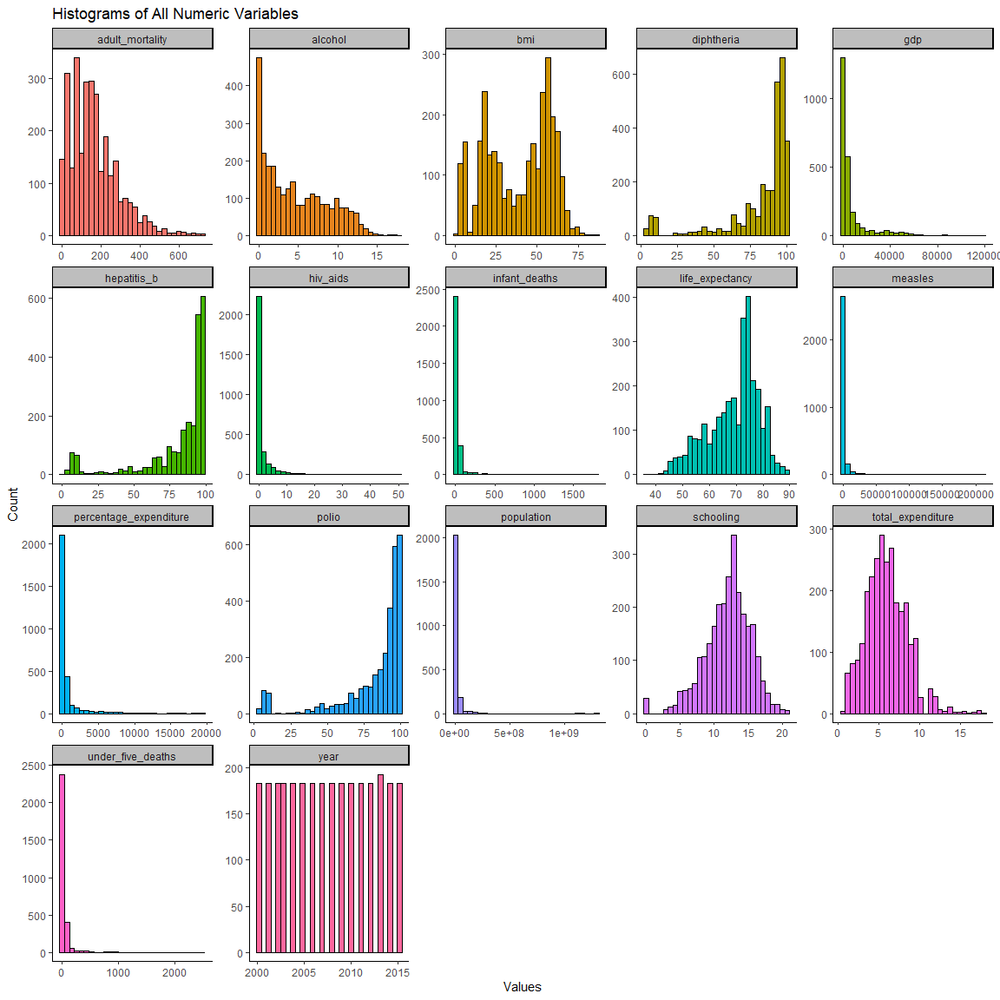<!-- -->

#### 1.2.1 Outliers

In **measles**, **infant_deaths** and **under_five_death** variables,
Some values exceed 1,000,which seems unrealistic given it is measured
per 1,000 population. However, I cross-checked the data against the
World Health Organization (WHO) website for reported data cases and the
figures matched the official WHO data. Even the maximum value of
measles - 212183 for year 2000 in Nigeria match WHO data. So I left the
figures like that.[\[measles data on WHO
website\]](https://immunizationdata.who.int/global/wiise-detail-page/measles-reported-cases-and-incidence?GROUP=Countries&YEAR=),
[\[Infant deaths and Under five deaths data on WHO
website\]](https://data.worldbank.org/indicator/SH.DTH.IMRT?end=2015&locations=IN&start=2000).
*It is important to note that these figures are wrong regardless and
should be investigated further against WHO database and should be
probably removed.*

    ## # A tibble: 6 × 3
    ## # Groups:   country, year, measles [6]
    ##   country                           year measles
    ##   <chr>                            <int>   <int>
    ## 1 Nigeria                           2000  212183
    ## 2 Democratic Republic of the Congo  2005  182485
    ## 3 Nigeria                           2001  168107
    ## 4 Nigeria                           2003  141258
    ## 5 Democratic Republic of the Congo  2011  133802
    ## 6 China                             2008  131441

    ## # A tibble: 6 × 4
    ## # Groups:   country, year, infant_deaths, under_five_deaths [6]
    ##   country  year infant_deaths under_five_deaths
    ##   <chr>   <int>         <int>             <int>
    ## 1 India    2001          1800              2400
    ## 2 India    2000          1800              2500
    ## 3 India    2003          1700              2200
    ## 4 India    2002          1700              2300
    ## 5 India    2004          1600              2100
    ## 6 India    2006          1500              2000

In **year** variable, I also noticed that year 2013 was over
represented. The other years had 183 countries while 2013 had 193
countries. Upon further investigation, I realized that these extra
countries in 2013 did not have data for any other year. Furthermore,
they were less known countries, so I made the decision to remove them
from the data set.

Table showing extra 10 countries in 2013

| year | count |
|-----:|------:|
| 2000 |   183 |
| 2001 |   183 |
| 2002 |   183 |
| 2003 |   183 |
| 2004 |   183 |
| 2005 |   183 |
| 2006 |   183 |
| 2007 |   183 |
| 2008 |   183 |
| 2009 |   183 |
| 2010 |   183 |
| 2011 |   183 |
| 2012 |   183 |
| 2013 |   193 |
| 2014 |   183 |
| 2015 |   183 |

Years Summary

Table showing countries with one observation only. These countries will
be removed from the data set. *NB:* *Use them only if you are analyzing
specifically and only 2013*

    ## # A tibble: 13 × 2
    ##    country               observations
    ##    <chr>                        <int>
    ##  1 Cook Islands                     1
    ##  2 Dominica                         1
    ##  3 Marshall Islands                 1
    ##  4 Monaco                           1
    ##  5 Nauru                            1
    ##  6 Niue                             1
    ##  7 Palau                            1
    ##  8 Saint Kitts and Nevis            1
    ##  9 San Marino                       1
    ## 10 Tuvalu                           1
    ## 11 Afghanistan                     16
    ## 12 Albania                         16
    ## 13 Algeria                         16

I also noticed that the **Alcohol** variable distribution had concerning
high number of zeros. Was this true representation of alcohol
consumption or were there some response bias from countries where
alcohol is ffrowned upon conservative Islamic countries? While this
could be true, I decided not to prob further and leave the figures as
they were.

The HIV and AIDS variable had a high number of 0 cases. I
counter-checked with WHO and the values were indeed correct.

#### 1.2.2 Check for missing values

Next I will inspect the data set for null values, that might affect the
validity of my analysis.

The Figure below shows the missing data patterns in the data set.

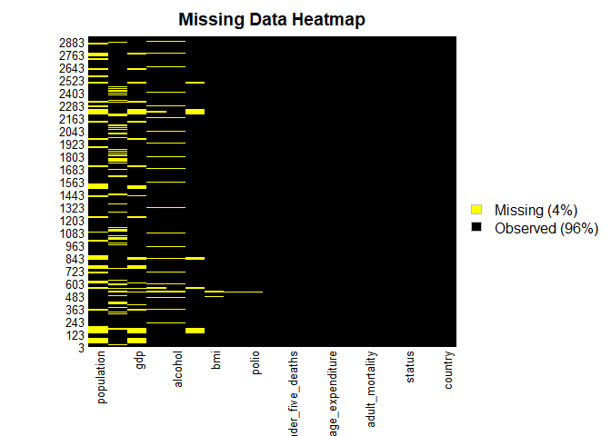<!-- -->

From the image it seems that the data is missing at random.

To understand the missingness further, we will inspect the count of each
variable’s missing data.

The table below shows the count and the percentage missing values for
each variable.

|  | Variable | Missing_Count | Missing_Percentage |
|:---|:---|---:|---:|
| country | country | 0 | 0.0000000 |
| year | year | 0 | 0.0000000 |
| status | status | 0 | 0.0000000 |
| life_expectancy | life_expectancy | 0 | 0.0000000 |
| adult_mortality | adult_mortality | 0 | 0.0000000 |
| infant_deaths | infant_deaths | 0 | 0.0000000 |
| alcohol | alcohol | 193 | 6.5915301 |
| percentage_expenditure | percentage_expenditure | 0 | 0.0000000 |
| hepatitis_b | hepatitis_b | 553 | 18.8866120 |
| measles | measles | 0 | 0.0000000 |
| bmi | bmi | 32 | 1.0928962 |
| under_five_deaths | under_five_deaths | 0 | 0.0000000 |
| polio | polio | 19 | 0.6489071 |
| total_expenditure | total_expenditure | 226 | 7.7185792 |
| diphtheria | diphtheria | 19 | 0.6489071 |
| hiv_aids | hiv_aids | 0 | 0.0000000 |
| gdp | gdp | 443 | 15.1297814 |
| population | population | 644 | 21.9945355 |
| schooling | schooling | 160 | 5.4644809 |

Missing Observations

It follows that we have to deal with these missing values before we do
any analysis or make any conclusions about factors affecting life
expectancy to avoid bias.

##### 1.2.2.1 Deal with the missing values

For the purposes of imputation, I replaced the missing values with
either mean or median depending on whether the variable’s distribution
was skewed or normal. I also separated the replacement by status since
for most variables, the distribution was different for both developing
and developed.

*NB: For Population and GDP, the values could be looked up in public
databases.*

**The following chart shows the distribution of variables that have
missing values**

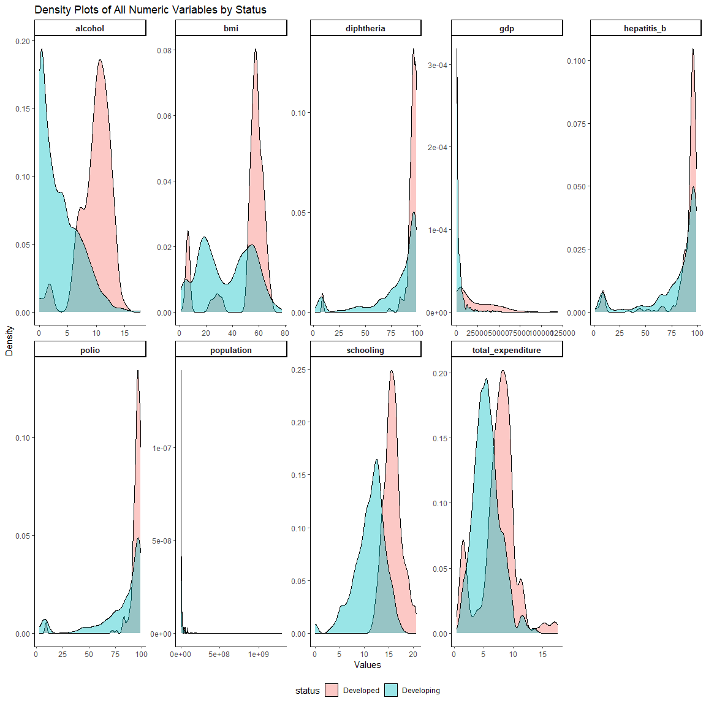<!-- -->

After the imputation is done, the table below shows The resulting data
frame without any missing data

|  | Variable | Missing_Count | Missing_Percentage |
|:---|:---|---:|---:|
| country | country | 0 | 0 |
| year | year | 0 | 0 |
| status | status | 0 | 0 |
| life_expectancy | life_expectancy | 0 | 0 |
| adult_mortality | adult_mortality | 0 | 0 |
| infant_deaths | infant_deaths | 0 | 0 |
| percentage_expenditure | percentage_expenditure | 0 | 0 |
| measles | measles | 0 | 0 |
| under_five_deaths | under_five_deaths | 0 | 0 |
| hiv_aids | hiv_aids | 0 | 0 |
| total_expenditure | total_expenditure | 0 | 0 |
| bmi | bmi | 0 | 0 |
| alcohol | alcohol | 0 | 0 |
| gdp | gdp | 0 | 0 |
| polio | polio | 0 | 0 |
| schooling | schooling | 0 | 0 |
| hepatitis_b | hepatitis_b | 0 | 0 |
| diphtheria | diphtheria | 0 | 0 |
| population | population | 0 | 0 |

Missing Observations

Now that all the data issues have been addressed, we can start our
analysis.

## 2 EXPLORATORY DATA ANALYSIS (EDA)

Our end goal is to understand factors influencing life expectancy and if
we can predict life expectancy from them.

We will start by inspecting our dependent variable first to have some
understanding on how it is distributed. Then I will explore correlation
matrix and scatter plots to understand the relationships between my
dependent variable and other variables so as to gather more insights
before creating a model.

#### **2.1 How is life expectancy distributed?**

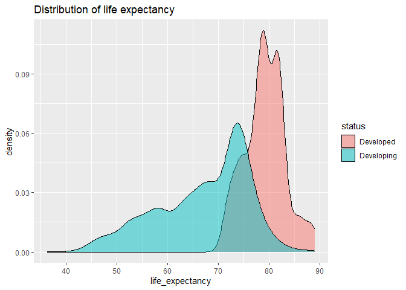<!-- -->

**Key take away**

- Developed countries have higher life expectancy.

#### 2.2 Correlation Matrix

First change the status category to numerical, and drop country and year
because those are not important in our next steps.

**Create the correction matrix to identify relationships of every
variable with life expectancy**

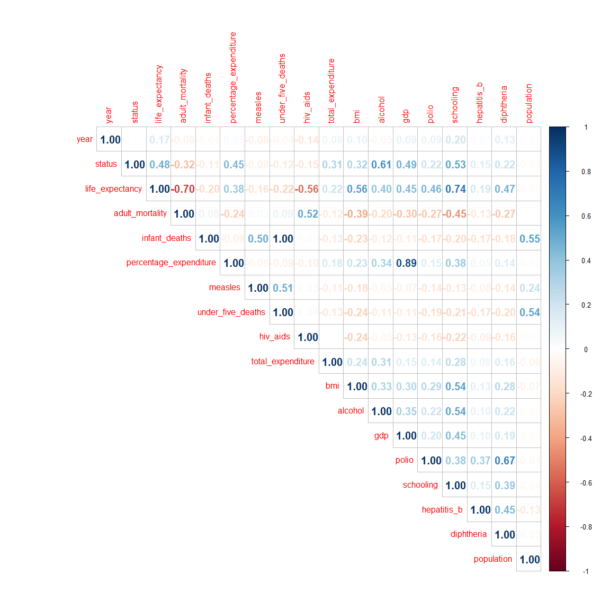<!-- -->

From the above diagram, we see that life expectancy is highly positively
correlated with

1.  Schooling (0.74)
2.  GDP (0.45)
3.  BMI(0.56)
4.  Alcohol (0.40)
5.  polio (0.46)
6.  Diphtheria (0.47)
7.  percentage expenditure (0.38)

and highly negatively correlated with

1.  Hiv and Aids (-0.59)
2.  Adult Mortality (-0.7025**) *Note: Be careful using mortality
    measures as drivers of life expectancy; this can be a tautology
    (“life expectancy is lower because more people die” is not a
    surprise).***

This starts to give us an idea of what factors positively or negatively
influence life expectancy.

##### 2.2.1 Investigate the top correlated Variables

Next, we draw some scatter plots to see linear relationship of life
expectancy with its key drivers (high correlation)

Note: Adult mortality will be excluded moving forward due to tautology

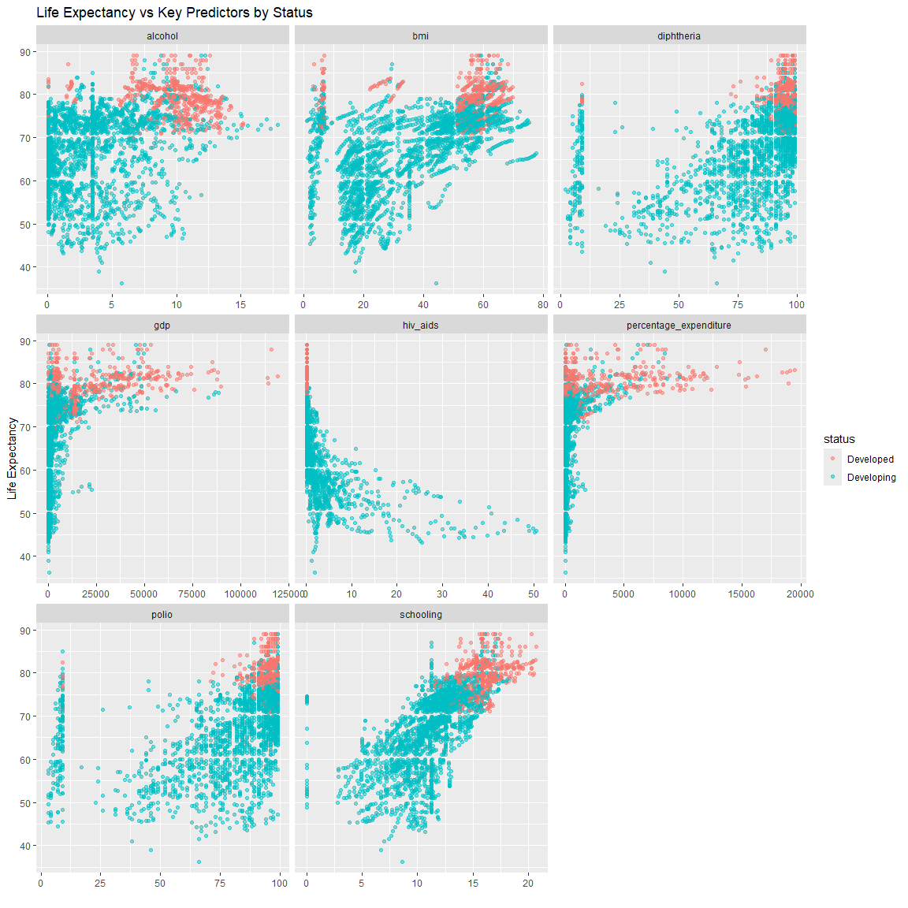<!-- -->

We are now starting to see some very clear pictures here. A variable
like school has a very strong relationship with life expectancy, a
firming that increase in education results to increase in life
expectancy. Hiv as well. Other variables have somewhat of strong
relationships as well, but the smooth chart below illustrates better.

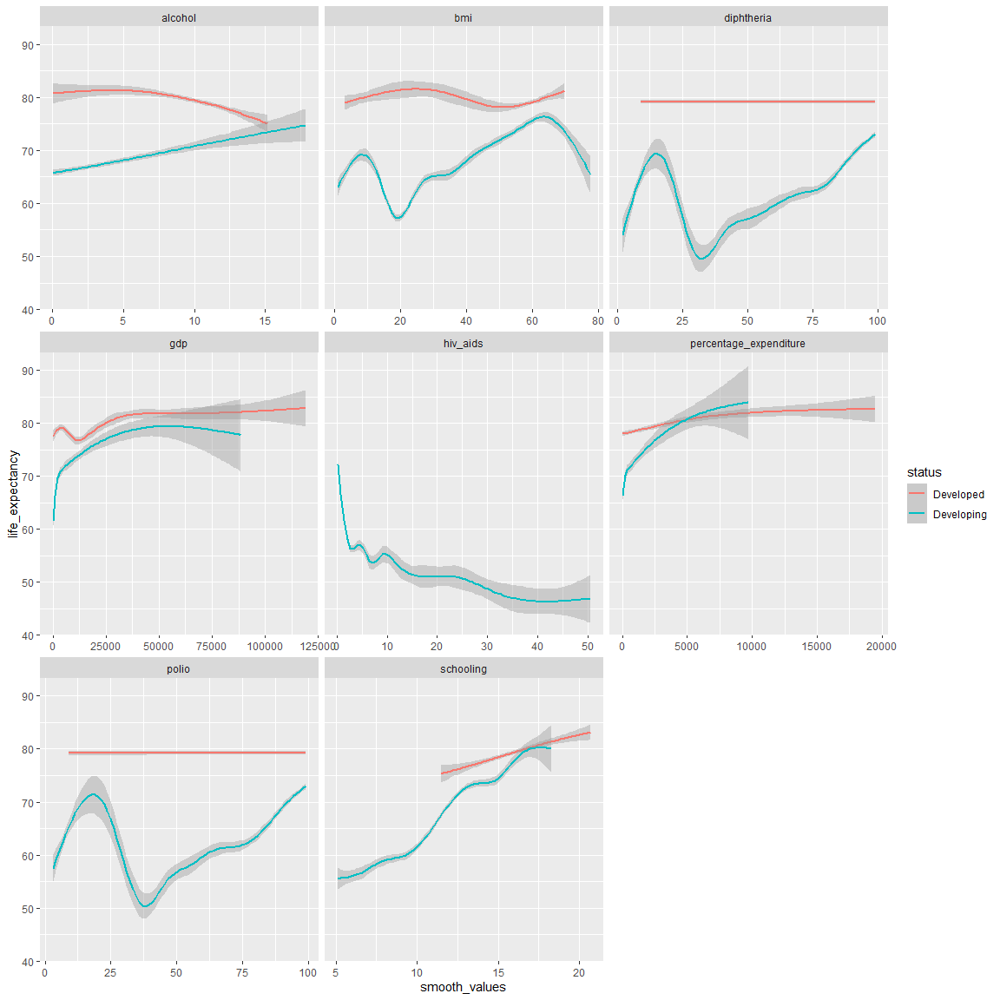<!-- -->

    ## $x
    ## [1] "predictor keys"
    ## 
    ## $y
    ## [1] "Life Expectancy"
    ## 
    ## $title
    ## [1] "Life Expectancy vs Key Predictors on smooth curve"
    ## 
    ## attr(,"class")
    ## [1] "labels"

Now the smooth graph illustrates some variables better, while these are
not fully liner lines, we see a Variable like hiv and aids having a
sharp decline as life expectancy increases. Other shapes might not be
very clear of a strong linear relationships, but these were the
variables that had less than 0.5 correlation coefficient. Next we we
will model our data in the next chapter.

We can now start formulating hypothesis on schooling, immunization rate(
polio and diphtheria) and hiv and aids.

One note on BMI and Alcohol Variables, the resulting graphs could seam counter intuitive. This is a classic case of correlation is not causation. One hypothesis could be that being able to afford alcohol is an indication of better living conditions hence higher life expectancy, as alcohol could be considered a luxury good. Also, Alcohol is complicated; there are reasons to report it wrongly, and higher onsumption could be a good sign or a bad sign... Also, though it's harmful, it can relieve stress which is also harmful. Hard to get a clear picture. 

## 3.5. HYPOTHESIS

Now that we have some idea on what is going on in the data, we can
formulate some hypothesis

#### **3.1. Hypothesis one:**

Hypothesis : Increased years of schooling significantly increase life
expectancy. Null Hypothesis : There is no significant relationship
between years of schooling with life expectancy.

#### **3.2. Hypothesis two:**

Hypothesis : Lower HIV prevalence is significantly associated with
increased life expectancy.

Null Hypothesis: HIV prevalence does not significantly affect life
expectancy.

#### **3.3. Hypothesis three:**

Hypothesis : increased immunization rate of polio and diphtheria are
significantly associated with increased life expectancy.

Null Hypothesis: Increased immunization rate of polio and diphtheria
does not have any relationship with life expectancy

#### **3.4. Hypothesis four:**

Hypothesis : increased percentage_expenditure is significantly
associated with increased life expectancy. Null Hypothesis: increased
percentage_expenditure does not have any relationship with life
expectancy

Now we can assess some models

# 4. MODELING OUR DATA

## 4.1 MULTIPLE LINEAR REGRESSION

Now we will try to predict the outcome variable life expectancy using
some independent variables. We will also see how much of the life
expectancy can be explained by the input variables.

I acknowledge that most variables do not have a complete straight line
in the smooth diagram. For that for school I will get rid of 0-5 years,
bmi will start from 30 , at the point which relationship is linear. I
will also be excluding adult mortality

#### 4.1.1 Prep the data

##### 4.1.1.1. Remove highly correlated variables

Before I start Multiple linear regression, I will check for
multicollineality

I will proceed to check the independent variables that are highly
correlated with each other and remove to reduce redundancy. This step is
critical for the following reasons

- To prevent incorrect variable selection and difficulty in
  interpretation. Multicollinearity can lead to the inclusion of
  irrelevant variables while excluding important ones, skewing the
  interpretation.

- To avoid inflated standard errors of the regression coefficients,
  making it difficult to determine the significance of individual
  predictors.

- To prevent overfitting

<!-- -->

percentage expenditure and gdp and highly correlated at 0.89, I will
chose percentage_expenditure since it is good to see what is the
influence of percentage_expenditure on dependent variable life
expectancy. Infant deaths and under five deaths are highly correlated. I
will choose under five deaths with -0.22 with is higher correlated with
dependent variable life expectancy.

I will remove them from modelling data frame. I will also be removing
adult mortality to prevent tautology, as mentioned earlier.

#### 4.1.2 Feature engineering

I will start with a bigger model then carefully select the important
factors.

    ## 
    ## Call:
    ## lm(formula = life_expectancy ~ ., data = df4)
    ## 
    ## Residuals:
    ##      Min       1Q   Median       3Q      Max 
    ## -27.0657  -2.7777  -0.0054   2.6852  20.3917 
    ## 
    ## Coefficients:
    ##                          Estimate Std. Error t value Pr(>|t|)    
    ## (Intercept)             4.616e+01  5.140e-01  89.802  < 2e-16 ***
    ## percentage_expenditure  5.059e-04  4.735e-05  10.686  < 2e-16 ***
    ## measles                -1.208e-05  8.715e-06  -1.386 0.165857    
    ## under_five_deaths      -2.325e-03  7.377e-04  -3.152 0.001637 ** 
    ## hiv_aids               -7.114e-01  1.770e-02 -40.190  < 2e-16 ***
    ## total_expenditure       2.760e-02  3.848e-02   0.717 0.473224    
    ## bmi                     6.497e-02  5.316e-03  12.224  < 2e-16 ***
    ## alcohol                 4.817e-02  2.670e-02   1.804 0.071312 .  
    ## polio                   3.861e-02  5.079e-03   7.603 3.88e-14 ***
    ## schooling               1.256e+00  3.744e-02  33.540  < 2e-16 ***
    ## hepatitis_b            -1.613e-02  4.256e-03  -3.789 0.000154 ***
    ## diphtheria              5.097e-02  5.270e-03   9.671  < 2e-16 ***
    ## population              3.740e-09  1.902e-09   1.966 0.049362 *  
    ## ---
    ## Signif. codes:  0 '***' 0.001 '**' 0.01 '*' 0.05 '.' 0.1 ' ' 1
    ## 
    ## Residual standard error: 4.638 on 2915 degrees of freedom
    ## Multiple R-squared:  0.7639, Adjusted R-squared:  0.7629 
    ## F-statistic: 785.8 on 12 and 2915 DF,  p-value: < 2.2e-16

I will try to drop variables here and whichever I drop and the model
improves, I will keep the new model and drop that variable.

I will start with total expenditure because it has a low p value. We do
not have enough evidence to reject the null hypothesis that it is
statistically significant.

    ##                Model Variables R_squared Adj_R_squared     AIC     BIC RMSE
    ##       Full (12 vars)        51    0.7639        0.7629 17308.4 17392.2 4.63
    ##       Drop total_exp        47    0.7638        0.7629 17307.0 17384.7 4.63
    ##         Drop measles        43    0.7637        0.7628 17307.0 17378.8 4.63
    ##      Drop population        39    0.7633        0.7626 17309.0 17374.8 4.63
    ##         Drop alcohol        35    0.7630        0.7624 17310.7 17370.5 4.64
    ##     Drop hepatitis_b        31    0.7618        0.7612 17324.5 17378.3 4.65
    ##           Drop polio        31    0.7618        0.7612 17324.5 17378.3 4.65
    ##             Drop bmi        27    0.7574        0.7569 17375.3 17423.1 4.69
    ##      Drop under_five        23    0.7437        0.7432 17534.6 17576.5 4.82
    ##  Drop percentage_exp        19    0.7412        0.7408 17561.2 17597.1 4.84
    ##        Drop hiv_aids        15    0.7300        0.7297 17683.0 17712.9 4.95
    ##      Drop diphtheria        11    0.5811        0.5808 18967.1 18991.0 6.16
    ##      Minimal (1 var)         7    0.5405        0.5404 19235.4 19253.4 6.45

    ## 
    ## Best by AIC: Drop total_exp

    ## 
    ## Best by BIC: Drop alcohol

    ## 
    ## Best by Adj R²: Full (12 vars)

##### 4.1.2.1 Rationale for Variable Elimination

Four variables were removed from the initial full model based on both
statistical and practical considerations:

**Variables Removed:**

total_expenditure

measles

population

alcohol

### Statistical Justification

The decision to remove these variables was informed by two key criteria:

#### 1. Statistical Insignificance

All four removed variables demonstrated **non-significant p-values** in
the full model:

total_expenditure: p = 0.473 (p \> 0.05)

measles: p = 0.169 (p \> 0.05)

population: p = 0.049 (borderline significance)

alcohol: p = 0.071 (p \> 0.05)

These high p-values indicate that these variables do not provide
statistically reliable contributions to predicting life expectancy when
other variables are present in the model.

#### 2. Minimal Impact on Model Performance

The removal of these variables resulted in negligible loss of
explanatory power:

| Model         | R²     | Adj R² | Performance Loss |
|---------------|--------|--------|------------------|
| Full Model    | 0.7639 | 0.7629 | \-               |
| After Removal | 0.7630 | 0.7624 | 0.0009 R² loss   |

The **0.0009 decrease in R-squared** represents less than 0.1% loss in
explained variance, demonstrating that these variables contribute
minimal unique information to the model.

### Model Parsimony Principle

Following the principle of parsimony (Occam’s razor), simpler models are
preferred when they achieve comparable performance to more complex
alternatives. The removal of these four variables:

- **Reduces model complexity** without sacrificing predictive accuracy

- **Improves interpretability** by focusing on meaningful predictors

- **Decreases risk of overfitting** by eliminating weak predictors

- **Enhances model stability** across different samples

After trying to drop one variable and a time, the final model is,

    ## 
    ## Call:
    ## lm(formula = life_expectancy ~ schooling + hiv_aids + diphtheria + 
    ##     polio + under_five_deaths + bmi + hepatitis_b + percentage_expenditure, 
    ##     data = df4)
    ## 
    ## Residuals:
    ##      Min       1Q   Median       3Q      Max 
    ## -26.7661  -2.7874  -0.0059   2.6557  20.9249 
    ## 
    ## Coefficients:
    ##                          Estimate Std. Error t value Pr(>|t|)    
    ## (Intercept)             4.603e+01  4.851e-01  94.876  < 2e-16 ***
    ## schooling               1.287e+00  3.447e-02  37.337  < 2e-16 ***
    ## hiv_aids               -7.076e-01  1.759e-02 -40.233  < 2e-16 ***
    ## diphtheria              5.198e-02  5.259e-03   9.884  < 2e-16 ***
    ## polio                   3.896e-02  5.083e-03   7.665 2.42e-14 ***
    ## under_five_deaths      -2.050e-03  5.602e-04  -3.660 0.000257 ***
    ## bmi                     6.665e-02  5.278e-03  12.629  < 2e-16 ***
    ## hepatitis_b            -1.684e-02  4.241e-03  -3.970 7.36e-05 ***
    ## percentage_expenditure  5.236e-04  4.665e-05  11.222  < 2e-16 ***
    ## ---
    ## Signif. codes:  0 '***' 0.001 '**' 0.01 '*' 0.05 '.' 0.1 ' ' 1
    ## 
    ## Residual standard error: 4.642 on 2919 degrees of freedom
    ## Multiple R-squared:  0.763,  Adjusted R-squared:  0.7624 
    ## F-statistic:  1175 on 8 and 2919 DF,  p-value: < 2.2e-16

### First check the assumptions before making conclusions

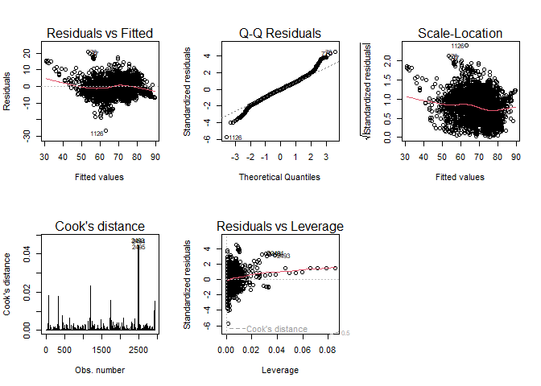<!-- -->

1.  **Residuals vs fitted** - Residuals are randomly scattered around
    the center line of zero with no pattern meaning residuals have
    constant variance. This condition is met in our model.
2.  The normality quantile plot of the residuals, **Q-Q Standardized
    Residuals**, shows that the errors are normally distributed
3.  For the fitted values vs the square root of standardized residuals
    in **Scale-Location**, The red line is horizontal meaning assumption
    of homoscedasticity is met. Also, there is no clear pattern i.e the
    spread of the residuals is roughly equal to all fitted values.
4.  For the cooks distance, when I look at the standardized residuals in
    the **Residuals vs Leverage** plot, no point lies outside cook’s
    distance, so there is no influential points.

Now that our residuals assumptions have been met, we can go ahead and
interpret our model.

    ## 
    ## Call:
    ## lm(formula = life_expectancy ~ schooling + hiv_aids + diphtheria + 
    ##     polio + under_five_deaths + bmi + hepatitis_b + percentage_expenditure, 
    ##     data = df4)
    ## 
    ## Residuals:
    ##      Min       1Q   Median       3Q      Max 
    ## -26.7661  -2.7874  -0.0059   2.6557  20.9249 
    ## 
    ## Coefficients:
    ##                          Estimate Std. Error t value Pr(>|t|)    
    ## (Intercept)             4.603e+01  4.851e-01  94.876  < 2e-16 ***
    ## schooling               1.287e+00  3.447e-02  37.337  < 2e-16 ***
    ## hiv_aids               -7.076e-01  1.759e-02 -40.233  < 2e-16 ***
    ## diphtheria              5.198e-02  5.259e-03   9.884  < 2e-16 ***
    ## polio                   3.896e-02  5.083e-03   7.665 2.42e-14 ***
    ## under_five_deaths      -2.050e-03  5.602e-04  -3.660 0.000257 ***
    ## bmi                     6.665e-02  5.278e-03  12.629  < 2e-16 ***
    ## hepatitis_b            -1.684e-02  4.241e-03  -3.970 7.36e-05 ***
    ## percentage_expenditure  5.236e-04  4.665e-05  11.222  < 2e-16 ***
    ## ---
    ## Signif. codes:  0 '***' 0.001 '**' 0.01 '*' 0.05 '.' 0.1 ' ' 1
    ## 
    ## Residual standard error: 4.642 on 2919 degrees of freedom
    ## Multiple R-squared:  0.763,  Adjusted R-squared:  0.7624 
    ## F-statistic:  1175 on 8 and 2919 DF,  p-value: < 2.2e-16

### Model interpretation.

In this model, our Adj. R-squared tells us that our model can explain
80% of life expectancy’s variability, which is good. The p value of f
F-statistic is also statistically significant, therefor, at least one of
our predictor variables can explain life expectancy.

Coming back to our hypothesis that we had formulated earlier, we can now
assess the p values from the model

#### Factors affect life expectancy

For the following variables, we have very good evidence to reject the
null hypothesis

1.***Hypothesis one:*** Hypothesis : Increased years of schooling
significantly increase life expectancy.

- **schooling** is Statistically Significant with a p value of less than
  0.001. We have good evidence to reject the null hypothesis and
  conclude that schooling is statistically associated with life
  expectancy, and while holding all other factors constant, for every
  year increase in schooling, life expectancy increases by 1.28.

2.***Hypothesis two:*** Hypothesis : Lower adult mortality rates and
lower HIV prevalence are significantly associated with increased life
expectancy.

- **hiv_aids** is also statistically significant with a p value of \<
  0.001. We have good evidence to reject the null hypothesis. For every
  extra hiv case reported, holding other factors, life expectancy
  reduces by 0.70

3.***Hypothesis three:*** Hypothesis : increased immunization rate is
significantly associated with increased life expectancy.

- **polio** and **diphtheria** p values all \< 0.001 there for we have
  good evidence to reject the null hypothesis and confident say that
  these values can explain life expectancy. For every percentage
  increase in polio immunization among one year olds, life expectancy
  increases by 0.038. Similarly for diphtheria, for every percent
  increase in DTP3 immunization, life expectancy increases by 0.04.

- **Hepatitis b** is also statistically significant, having a p value of
  \< 0.001. It follows that we have good evidence to reject null
  hypotheses. Hepatitis B is associated with life expectancy and we can
  infer that for every percent increase in hepatitis b immunization
  among one year olds, life expectancy reduces by 0.017

4.***Hypothesis four:*** Hypothesis : increased percentage_expenditure
is significantly associated with increased life expectancy.

- **percentage expenditure** is also statistically significant, having a
  p value of \< 0.001. It follows that we have good evidence to reject
  null hypotheses. percentage expenditure is associated with life
  expectancy and we can infer that for every percentage expenditure
  increase, life expectancy increases by 0.0005

## Further confirmatory analysis

Predicted values vs Fitted values

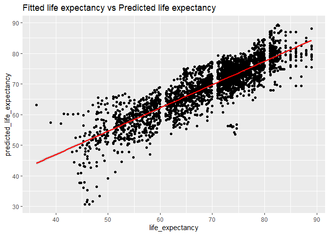<!-- -->

From the model we built, we see clearly that the the predicted values
are correlated very well with the fitted values and the trend is very
evident.

Here, we look into key factors of life expectancy.

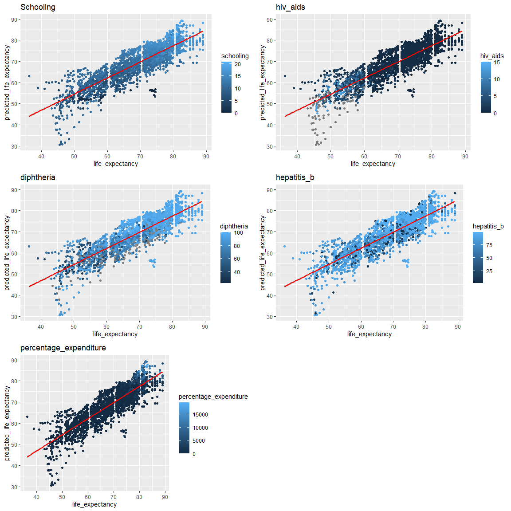<!-- -->

In conclusion, factors affecting life expectancy are; Schooling,
Hiv_Aids and Immunization rate (diphtheria, polio and hepatitis b)

## 4.1 PRINCIPAL COMPONENT ANALYSIS

In this technique, we will use PCA to understand our data more by
reducing it from high-dimensional space to a smaller dimensional space
that is easy to understand.

We will run PCA on the data frame below that has predictor variables
only and does not have non-numerical variables

    ## # A tibble: 6 × 16
    ##   status adult_mortality infant_deaths percentage_expenditure measles
    ##    <dbl>           <int>         <int>                  <dbl>   <int>
    ## 1      0             263            62                  71.3     1154
    ## 2      0             271            64                  73.5      492
    ## 3      0             268            66                  73.2      430
    ## 4      0             272            69                  78.2     2787
    ## 5      0             275            71                   7.10    3013
    ## 6      0             279            74                  79.7     1989
    ## # ℹ 11 more variables: under_five_deaths <int>, hiv_aids <dbl>,
    ## #   total_expenditure <dbl>, bmi <dbl>, alcohol <dbl>, gdp <dbl>, polio <int>,
    ## #   schooling <dbl>, hepatitis_b <dbl>, diphtheria <int>, population <dbl>

### Summary of pca

    ## Importance of components:
    ##                           PC1    PC2    PC3     PC4    PC5     PC6    PC7
    ## Standard deviation     2.1255 1.5888 1.2928 1.13098 1.0575 0.90630 0.8626
    ## Proportion of Variance 0.2823 0.1578 0.1045 0.07995 0.0699 0.05134 0.0465
    ## Cumulative Proportion  0.2823 0.4401 0.5446 0.62452 0.6944 0.74575 0.7923
    ##                            PC8     PC9    PC10    PC11    PC12    PC13    PC14
    ## Standard deviation     0.81763 0.77569 0.70183 0.66553 0.60232 0.58353 0.55869
    ## Proportion of Variance 0.04178 0.03761 0.03078 0.02768 0.02267 0.02128 0.01951
    ## Cumulative Proportion  0.83404 0.87164 0.90243 0.93011 0.95279 0.97407 0.99358
    ##                           PC15    PC16
    ## Standard deviation     0.31609 0.05355
    ## Proportion of Variance 0.00624 0.00018
    ## Cumulative Proportion  0.99982 1.00000

From this summary, we can see that PC1 can explain 28% of the
variability of our data, PC2 cumulatively with PC1 holds 44% of
information, PC3 together with PC1 and PC2 can explain 54% of
variability in the data. By choosing PC1 to PC3 which gives us at least
50% of info in the data, we have reduced our variables from 15 to 3, as
shown in the diagram below.

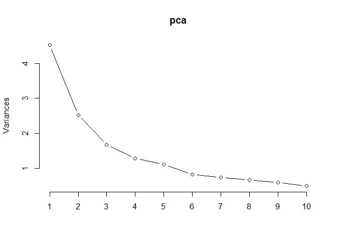<!-- -->

We can safely ignore PC 4, 5, 6, to 10. while this makes us loose Little
bit of some predictability power, it is not so much.

**Visualizing, PC1 and PC2**

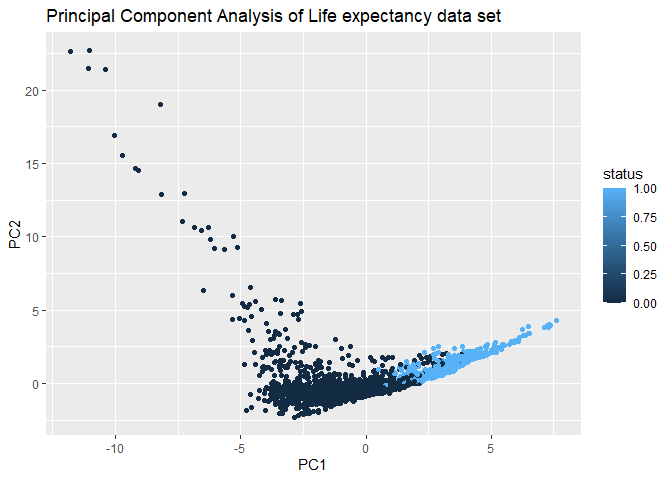<!-- -->

From the above graph, we see two status developed (1) and developing (0)
when project to two dimension space, there is some distinct difference
at a point, the developing countries are more spread out. Additionally,
developed countries mainly live in PC1. Next, we translate principle
component analysis to graphs so that we can interpret what each PCA
represents

### In-depth analysis into each Principle component

#### Principal component 1

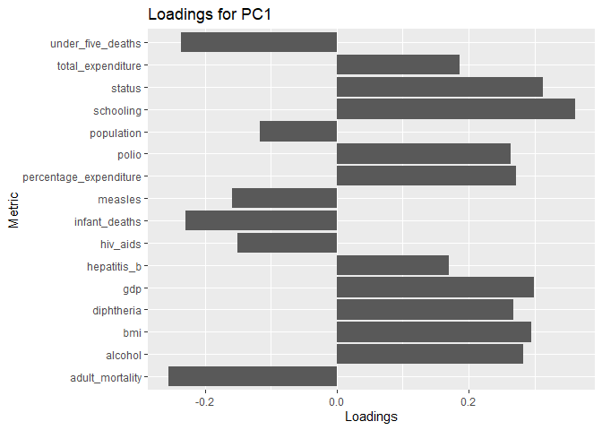<!-- -->

| Variable               | PC1                    |
|:-----------------------|:-----------------------|
| adult_mortality        | **-0.255866996926452** |
| under_five_deaths      | -0.236292821554044     |
| infant_deaths          | -0.230272663611179     |
| measles                | -0.158670431978046     |
| hiv_aids               | -0.151442075315388     |
| population             | -0.11615548354312      |
| hepatitis_b            | 0.17067698812493       |
| total_expenditure      | 0.186106203692254      |
| polio                  | **0.263557688032919**  |
| diphtheria             | **0.268468071297081**  |
| percentage_expenditure | **0.272366994673108**  |
| alcohol                | **0.282807993836458**  |
| bmi                    | **0.294711465949317**  |
| gdp                    | **0.299268502061483**  |
| status                 | **0.312621447546073**  |
| schooling              | **0.361182044913443**  |

pc1 loadings

**Inference**

Countries that are high in PC1 are very high in schooling, and high in
gdp and high in bmi, high in alcohol consumption , low in adult
mortality. The first principal component increases with increase in
schooling, and increase in bmi and increase in alcohol and decrease with
increase in adult mortality. So it is a measure if quality of education,
high gdp and high consumption of luxury goods(alcohol, fast food for
bmi). The countries follow the pattern of developed countries we saw
earlier. and developed countries had high life expectancy.

This PC may be interpreted as good healthcare society

#### Principal component 2

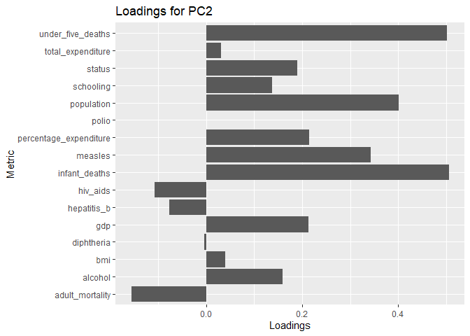<!-- -->

| Variable               | PC2                   |
|:-----------------------|:----------------------|
| adult_mortality        | -0.155911057372955    |
| hiv_aids               | -0.10781175285824     |
| hepatitis_b            | -0.0769199889059163   |
| diphtheria             | -0.00378113112340225  |
| polio                  | 0.000501888692852018  |
| total_expenditure      | 0.0309139737629837    |
| bmi                    | 0.0395801804866347    |
| schooling              | 0.137333170161737     |
| alcohol                | 0.158846224107971     |
| status                 | 0.190073103133625     |
| gdp                    | 0.212638027249478     |
| percentage_expenditure | 0.214400462477639     |
| measles                | **0.342241218980898** |
| population             | **0.401108412121931** |
| under_five_deaths      | **0.501083050894745** |
| infant_deaths          | **0.505084982927272** |

pc2 loadings

**Inference** The second principle component increases with increase in
Infant deaths, under five deaths, population and number of reported
measles cases/1000 population .This suggests that countries with high
infant deaths, high under five deaths, and high measles numbers tend to
have high population. This principle component represents developing
countries, as seen earlier and in the pca plot.

#### Principal component 3

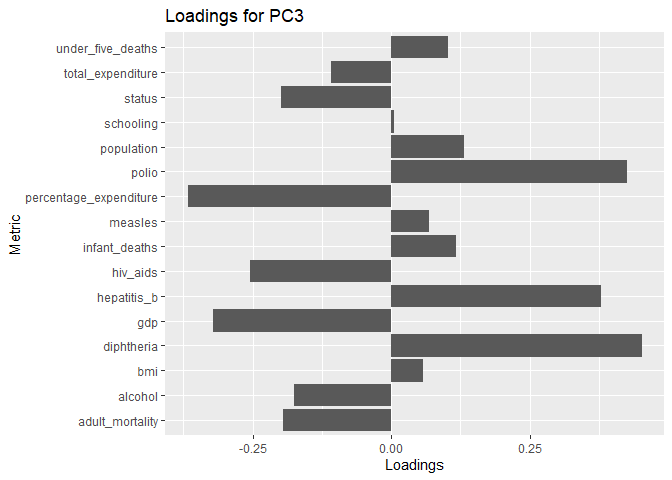<!-- -->

| Variable               | PC3                    |
|:-----------------------|:-----------------------|
| percentage_expenditure | **-0.366924925421369** |
| gdp                    | **-0.321770126689287** |
| hiv_aids               | **-0.255163607454017** |
| status                 | -0.198453896951771     |
| adult_mortality        | -0.195017050838467     |
| alcohol                | -0.175111927443356     |
| total_expenditure      | -0.108879353755993     |
| schooling              | 0.00426134458294464    |
| bmi                    | 0.0577356119759394     |
| measles                | 0.0678217527171096     |
| under_five_deaths      | 0.101631285188604      |
| infant_deaths          | 0.116107113762892      |
| population             | 0.13208525003737       |
| hepatitis_b            | **0.377809388045248**  |
| polio                  | **0.425368987154183**  |
| diphtheria             | **0.451553724019108**  |

pc3 loadings

**Inference** The third principle component increases with
hepatitis_b,polio, diphtheria immunization coverage, which is good, and
increases with decrease in gdp and percentage expenditure. This PCA
captures high positive public health while having challenges of
government expenditure on health and low gdp. This means that places
with high immunization rate tend to have low economic indicators. I cant
really tell which countries are these in the third dimension.

#### Summary

In summary, developed countries are represented by pc1 and they have
characteristics of high education, high in gdp, have lower deaths and
consume for luxury goods like alcohol and foods that cause high bmi.

Developing countries on the other hand, are represented by pc1 and they
have characteristics of high population, high infant deaths and high
under five deaths, and high measles rates.

######################################################################################################################################################## 

# Q.2 - EXECUTIVE SUMMARY

Life expectancy can be determined by many factors including economic,
social and heath factors. Countries with limited access to heath care
might for instance experience high mortality rates - both adults and
infants, high disease rates and so forth. Due to advancements in
technology, policy making and medicine in the last few years, it has
become imperative to understand the factors affecting life expectancy
and act on them. This report provides a detailed analysis of factors
affecting life expectancy and provides data driven recommendations to
governments and policy makes on on how they can improve life expectancy.

## Key findings

1.**Increase in number of years in school increases the life
expectancy** The number of years a person stays in school is very
important for their longevity. This report found a compelling evidence
of the importance of school, concluding that for every extra year that
someone stays in school, their life expectancy increases by 1.05 years.
This was evident in developed countries which have prioritized resource
allocation on education. Developed countries had higher life expectancy
because on average, the number of years spent on education is higher
compared to their counterparts.

The table below shows that developed countries have higher education
levels on average. It also shows life expectancy of developed countries
being on the higher side compared to developing countries.

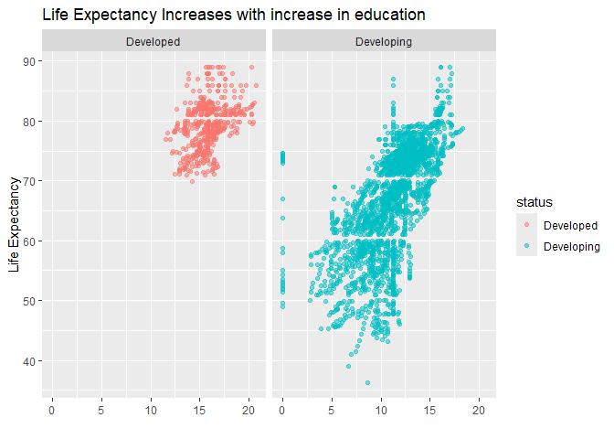<!-- -->

**Recommendation:** This supports a call for government’ increased
spending and investment on education as a important step towards
improving life expectancy.

2.**Reduced hiv_aids numbers will increase life span.**

The report found that low levels of hiv were associate with 0.5 years
increase in life expectancy. This is because high levels of hiv and aids
numbers increase mortality rate, leading to reduced life expectancy. The
report found that countries that had high levels of hiv and aids had
high levels of mortality, underscoring the importance of preventing more
cases.

**Recommendation** Governments and policy makes should increase funding
to hiv and aids awareness campaigns, Increase education and
affordability on antiviral hiv medicine for the ailing aids population.

3.**Expand Immunization Programs**

Immunization was also found to be a key factor affecting life
expectancy. Regions with low immunization rate of polio, hepatitis B and
diphtheria saw a decline in life expectancy.

**Recommendation** Governments should increase outreach for vaccination
amongst one year olds in hospitals, communities and in schools

3.**percentage expenditure Increase** Increase in government expenditure
on healthcare was found to positively influence life expectancy.

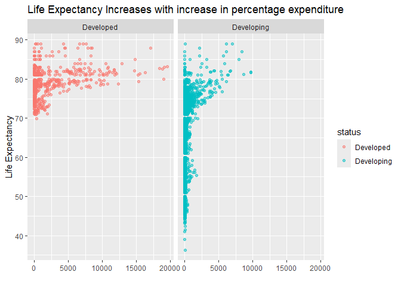<!-- -->

The chart above shows that life expectancy is increasing with increase
in percentage expenditure. I it is especially evident in developed
coutries.

**Recommendation** Governments should consider allocating more budget on
healthcare.

In summary, this report shows how data analysis exposes the factors that
influence life expectancy and highlights it as a key tool for
organizations, both private and non private. By understanding these
factors, governments and organizations can drive meaningful change,
ensuring that people live longer and healthier lives. Moving forward,
the ability to leverage data will remain crucial to solving pressing
global challenges.
